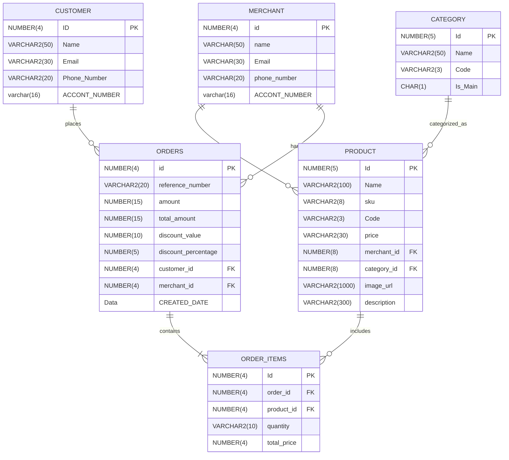

# Order API

## Overview
The Order API is designed to handle the order creation process and integrates with several APIs to manage coupons, store stock, banking transactions, and notifications. Below is a detailed breakdown of how the order process works.

## Order Creation Process

### 1. Coupon Validation and Consumption
- When an order is created, if the customer applies a coupon, the system validates the coupon using the **Coupon API**.
- Once validated, the coupon is marked as consumed to prevent future use.

### 2. Stock Consumption
- After validating the coupon, the system checks product availability by calling the **Store API**.
- It ensures that the required stock is available and reduces the stock based on the quantity ordered.

### 3. Payment Processing
- The system integrates with the **Bank API** to handle payments:
  - Withdraws the total order amount from the customer's account and saves the transaction ID for record-keeping.
  - Deposits the order amount into the merchant’s account, completing the payment process.

### 4. Order Notifications
- Once the order is successfully created and processed, notifications are sent out via the **Notification API** to keep both the customer and merchant informed about the order status via email or SMS.

## Order Search Functionality
The application provides the ability to search for orders based on:
- **Customer Information**: Search for all orders associated with a specific customer.
- **Date Range**: Filter orders by a specific date range for efficient reporting and analysis.

## Customer Portal
The application includes a **Customer Portal** where users can:
- **View Products**: Display a list of available products for purchase.
- **Checkout**: Once products are selected, the customer can proceed to checkout, triggering the order creation process as detailed above.

## ERD

